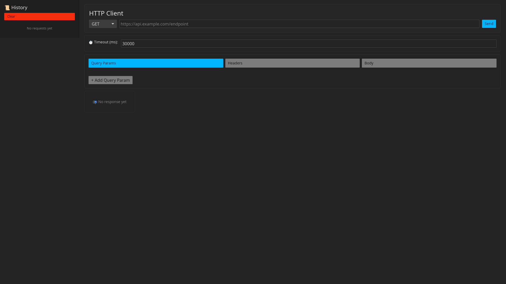

# 🚀 HTTP Client - Rust Desktop Application

> **Modern HTTP client built with Rust and Iced framework**  
> A Postman-like tool with native performance, clean architecture, and intuitive UI.


---

## 📸 Screenshots

<!-- TODO: Add screenshots here -->



<!--  -->

**Note**: Run `cargo run` to see the application in action!

---

## ✨ Features

### 🔥 Core Functionality

- **Full HTTP Methods Support**: GET, POST, PUT, PATCH, DELETE
- **Smart URL Validation**: Auto-adds `https://` if missing
- **Custom Headers**: Add, remove, and toggle headers on/off
- **Query Parameters**: Dynamic key-value pairs with enable/disable
- **Request Body**: Support for JSON, Raw text, and None
- **Response Viewer**: Formatted JSON, headers, status codes with color coding

### 📊 Advanced Features

- **Persistent History**: Last 50 requests automatically saved to disk (survives app restart)
- **JSON Formatter**: Automatic pretty-printing of JSON responses
- **Response Tabs**: Switch between Body and Headers views
- **Timeout Configuration**: Customizable request timeout (default: 30s)
- **Loading States**: Visual feedback during request processing
- **Error Handling**: Clear, user-friendly error messages

### ⚡ Performance & UX

- **Native Performance**: No Electron, pure Rust GUI
- **Modern UI**: Clean interface with Oxocarbon theme
- **Async Operations**: Non-blocking HTTP requests with Tokio
- **Type Safety**: Leveraging Rust's type system for reliability

---

## 🏗️ Architecture

Built with **The Elm Architecture (TEA)** pattern for predictable state management:

```
src/
├── main.rs                    → Application entry point & UI layer
├── components/
│   ├── enums.rs              → Type definitions (Message, HTTPMethod, etc.)
│   ├── http_client.rs        → HTTP logic (reqwest + tokio runtime)
│   ├── history.rs            → Request history management (max 50 items)
│   ├── pick_list.rs          → Custom dropdown components
│   ├── styles.rs             → UI styling and themes
│   ├── utils.rs              → Validators, formatters, helpers
│   └── ui/
│       ├── body_editor.rs    → Request body editor
│       ├── error_message.rs  → Error display component
│       ├── header.rs         → Main header with method/URL/Send
│       ├── history_view.rs   → Sidebar history list
│       ├── key_value_list.rs → Reusable headers/params editor
│       ├── request_tabs.rs   → Query/Headers/Body tabs
│       ├── response_view.rs  → Response display with tabs
│       └── timeout_config.rs → Timeout configuration input
```

### Design Principles

1. **Separation of Concerns**: UI in `main.rs`, business logic in `http_client.rs`
2. **The Elm Architecture**: `App` (state) → `Message` (actions) → `update()` (transitions) → `view()` (render)
3. **Type-Driven Development**: Extensive use of enums for type safety
4. **Component Modularity**: Reusable UI components in `ui/` module

See [ARCHITECTURE.md](ARCHITECTURE.md) for detailed design decisions and implementation notes.

---

## 🚀 Quick Start

### Prerequisites

- **Rust 1.75+** ([Install here](https://rustup.rs/))
- Linux/macOS/Windows supported

### Installation

```bash
# Clone the repository
git clone https://github.com/Kaycfarias/http-client
cd http-client

# Run in development mode
cargo run

# Build optimized release binary
cargo build --release

# The binary will be at: target/release/http-client
```

### First Request

1. **Launch the application**

   ```bash
   cargo run
   ```

2. **Select HTTP method** from dropdown (default: GET)

3. **Enter URL**

   ```
   jsonplaceholder.typicode.com/posts/1
   ```

   (Auto-adds `https://` if missing)

4. **Click "Send"** 🚀

5. **View formatted response** in the response panel

---

## 🧪 Testing

```bash
# Run all tests
cargo test

# Run tests with output
cargo test -- --nocapture

# Check code without building
cargo check

# Run linter
cargo clippy

# Format code
cargo fmt
```

### Test Endpoints

Use these public APIs for testing:

```bash
# GET request
GET → https://jsonplaceholder.typicode.com/posts/1

# POST request
POST → https://jsonplaceholder.typicode.com/posts
Body (JSON):
{
  "title": "foo",
  "body": "bar",
  "userId": 1
}
```

**Note**: Some APIs (e.g., ReqRes) use Cloudflare protection and may reject custom HTTP clients. This is not an application error.

---

## 📚 Tech Stack

| Technology                                            | Purpose                            | Version |
| ----------------------------------------------------- | ---------------------------------- | ------- |
| **[Rust](https://www.rust-lang.org/)**                | Systems programming language       | 1.75+   |
| **[Iced](https://iced.rs/)**                          | Cross-platform GUI framework       | 0.14    |
| **[Reqwest](https://github.com/seanmonstar/reqwest)** | HTTP client library                | 0.13    |
| **[Tokio](https://tokio.rs/)**                        | Async runtime                      | 1.49    |
| **[Serde](https://serde.rs/)**                        | JSON serialization/deserialization | 1.0     |
| **[Chrono](https://github.com/chronotope/chrono)**    | Date/time handling                 | 0.4     |
| **[Dirs](https://github.com/dirs-dev/dirs-rs)**       | User directories (config storage)  | 5.0     |

### Why These Technologies?

- **Rust**: Memory safety, zero-cost abstractions, and native performance
- **Iced**: Elm-inspired architecture for predictable UI state management
- **Reqwest**: Battle-tested HTTP client with async support
- **Tokio**: Efficient async I/O for non-blocking requests

---

## 🎯 Roadmap

### Completed Features

- [x] **Persistent History**: History saved to disk with JSON (auto-loads on startup)

### Planned Features

- [ ] **Authentication Support**: Bearer Token, Basic Auth, API Key
- [ ] **Environment Variables**: Manage Dev/Staging/Prod configs
- [ ] **Collections**: Group related requests (like Postman)
- [ ] **Export/Import**: cURL, Postman collections, OpenAPI
- [ ] **Request Cancellation**: Cancel in-flight requests
- [ ] **Response History**: View past responses for each request
- [ ] **Custom Themes**: Light/Dark mode support
- [ ] **Keyboard Shortcuts**: Power user features
- [ ] **WebSocket Support**: Real-time communication testing

### Performance Improvements

- [ ] Request caching for GET requests
- [ ] Lazy loading for large responses
- [ ] Streaming support for large payloads

---

## 🤝 Contributing

Contributions are welcome! Please follow these guidelines:

### Setup

1. Fork the repository
2. Create a feature branch: `git checkout -b feat/amazing-feature`
3. Make your changes
4. Run tests: `cargo test`
5. Format code: `cargo fmt`
6. Check lints: `cargo clippy`
7. Commit: `git commit -m 'Add amazing feature'`
8. Push: `git push origin feat/amazing-feature`
9. Open a Pull Request

### Code Style

- Follow Rust naming conventions
- Add documentation comments for public APIs
- Write tests for new functionality
- Keep functions focused and modular
- Update ARCHITECTURE.md if adding major features

---

## 📖 Documentation

- **[ARCHITECTURE.md](ARCHITECTURE.md)** - Detailed design decisions and patterns
- **[.github/copilot-instructions.md](.github/copilot-instructions.md)** - AI agent development guidelines
- **Inline Documentation** - Run `cargo doc --open` for generated docs

---

## 📄 License

This project is licensed under the **MIT License** - see the [LICENSE](LICENSE) file for details.

---

## 👤 Author

**Kayc Farias**

- GitHub: [@Kaycfarias](https://github.com/Kaycfarias)
- LinkedIn: [Kayc Farias](https://www.linkedin.com/in/kayc-farias-b32840283)

---

## 🙏 Acknowledgments

- **[Iced Community](https://github.com/iced-rs/iced)** - For the excellent GUI framework
- **[Rust Community](https://www.rust-lang.org/community)** - For making Rust awesome
- **JSONPlaceholder** - For providing free testing endpoints

---

## 💡 Why I Built This

This project was created to:

1. **Learn Advanced Rust**: Practice async programming, GUI development, and error handling
2. **Explore Iced Framework**: Understand The Elm Architecture pattern in Rust
3. **Build Production-Ready Tools**: Focus on UX, validation, and clear error messages
4. **Provide an Alternative**: Native HTTP client without Electron overhead

---

## ⭐ Star This Repo

If you find this project useful, please consider giving it a star! It helps others discover the project and motivates further development.

---

**Made with ❤️ and Rust 🦀**
